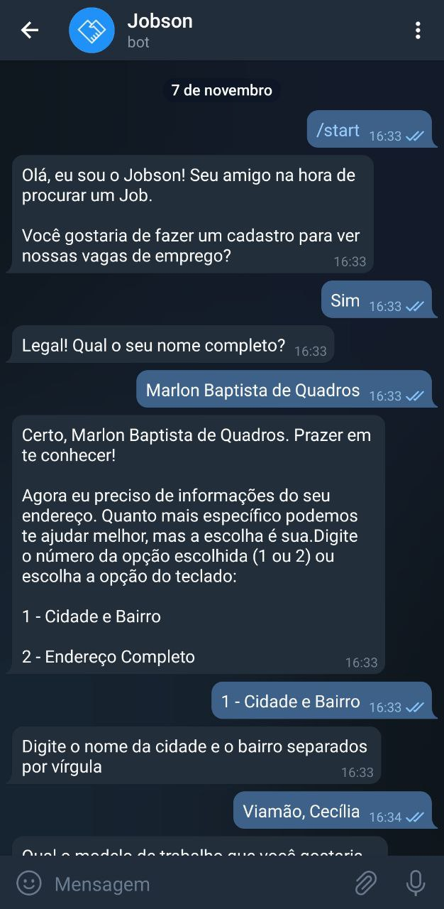

# Bot Jobson Telegram

Repositório de código do Bot (Jobson) do Telegram. Ele roda na AWS Lambda, armazena o estado da conversa e os dados do usuário no Dynamodb.

O Jobson pode ser acessado pelo link: [Jobson](https://t.me/JobSouthBot)

## Bibliotecas

- [python-telegram-bot](https://github.com/python-telegram-bot/python-telegram-bot)
- [serverless-framework](https://www.serverless.com/)
- [PynamoDB](https://github.com/pynamodb/PynamoDB)
